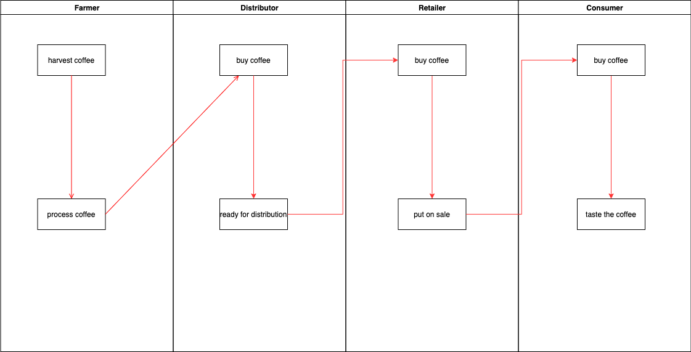

# Blockchain Project3

### Libraries:
-   `Truffle`: version `5.4.2`
    -   used to develop, test and deploy smart contracts
-   `Solidiy`: version `0.5.16`
    -   solidity compiler
-   `Web3.js`: version `1.5.1`
    -   frontend library to interract with smart contracts
-   `truffle-hdwallet-provider`: version `1.0.17`
    -   used to sign transaction when i deploy the contract to public network

### Rinkeby Contract:
- `Contact Address`: `0x7e444f9b5c3f083dD4bf7b127Fabc369865B4749`
- `Transaction Address`: `0x667b58d7d270b3f1fdac0ae44e6c6cc43f3cc8c484e5c220e58162d2e72f7798`

### Steps to run local environment:
1. start local blockchain using `ganache-cli` or `ganache gui`
2. make sure `truffle.js` config is pointing to the local blockchain
3. run `truffle compile` to compile the contracts
4. run `truffle migrate` to migrate the contracts to local blockchain
5. run `truffle test` to test all the cases
6. run `npm run dev` to start local frontend

### UML
Activity Diagram

Class Diagram

Sequence Diagram

State Diagram

